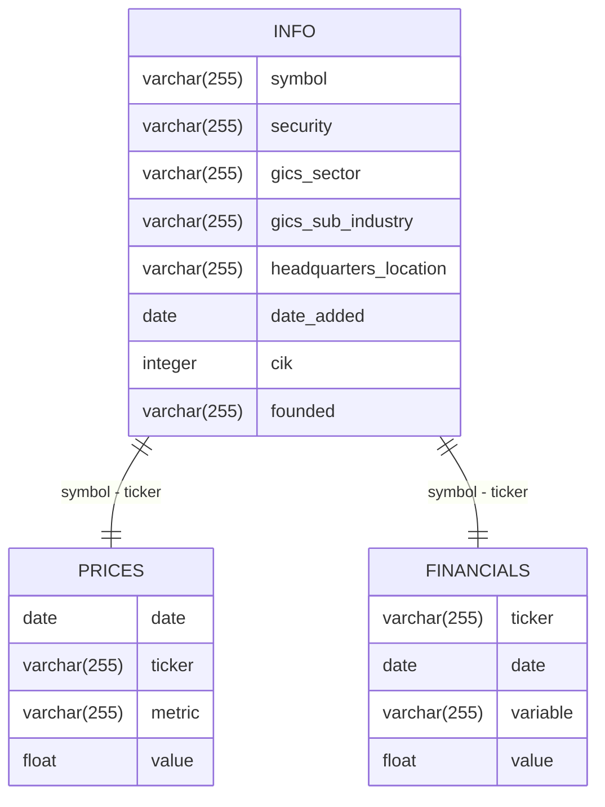

# S&P 500 Data Engineering Project

This project consists of two data pipelines that scrape S&P 500 company information, stock prices, and quarterly financials from Wikipedia and Yahoo Finance. The data is visualized in two dashboards, one created with Streamlit and the other with Tableau.

## Project Structure
```
.
├── 01_source_info
│   └── ...
├── 02_source_prices
│   └── ...
├── 03_source_financials
│   └── ...
├── 11_source_info_gdrive
│   └── ...
├── 12_source_prices_gdrive
│   └── ...
├── 13_source_financials_gdrive
│   └── ...
├── dashboard_streamlit
│   └── ...
├── dashboard_tableau
│   └── ...
├── tests
│   ├── end_to_end_tests
│   │   └── ...
│   ├── integration_tests
│   │   └── ...
│   └── unit_tests
│       └── ...
├── 001_build_containers.sh
├── 002_run_tests.sh
├── 003_deploy_all.sh
├── README.md
├── create_tables.sql
├── etl_spx_dashboard.py
├── etl_spx_dashboard_gdrive.py
└── set_env.sh
```

## Dashboards

- **Streamlit Dashboard**: Provides a comprehensive view of the SP500 data using PostgreSQL as the data source. The live Streamlit dashboard can be accessed at [https://www.juanberger.com/spx-streamlit](https://www.juanberger.com/spx-streamlit).


- **Tableau Dashboard**: Visualizes a limited dataset (due to Google Sheets constraints) and is embedded in the project website. Due to the limitations of Tableau Public the data is not updated daily, only the original version of the data is showcased. The dashboard can be accessed at [https://www.juanberger.com/spx-tableau](https://www.juanberger.com/spx-tableau).


## Apache Airflow DAGs

- The first DAG scrapes the data and stores it in a PostgreSQL database. The data in PostgreSQL is used to populate the Streamlit dashboard and is found in the `etl_spx_dashboard.py` file. This DAG consists of three Docker operators:
    - 01_source_info: Scrapes the S&P 500 company information from Wikipedia.
    - 02_source_prices: Scrapes the S&P 500 stock prices from Yahoo Finance.
    - 03_source_financials: Scrapes the S&P 500 quarterly financials from Yahoo Finance.


- The second DAG scrapes the data and stores it in Google Sheets. The data in Google Sheets is used to populate the Tableau dashboard and is found in the `etl_spx_dashboard_gdrive.py` file. This DAG consists of three Docker operators:
    - 11_source_info_gdrive: Scrapes the S&P 500 company information from Wikipedia.
    - 12_source_prices_gdrive: Scrapes the S&P 500 stock prices from Yahoo Finance.
    - 13_source_financials_gdrive: Scrapes the S&P 500 quarterly financials from Yahoo Finance.


## PostgreSQL Database Schema

The PostgreSQL database schema includes three primary tables: `info`, `prices`, and `financials`. Clustered indexes and partitioning are used to optimize query performance. 10 years of prices data and the last 4 quarters of financials data are stored in the database.



## Google Sheets API
Given that Tableau Public does not support direct connections to databases, the Google Sheets API is used to store the data for the Tableau dashboard. The data is stored in three separate sheets: `info`, `prices`, and `financials`. The Google Sheets API is accessed using the `gspread` library in Python. Due to the limitations of Google Sheets, only 100 days of prices data are stored in the Google Sheets.

## Testing

The project includes a comprehensive test suite with unit tests, integration tests, and end-to-end tests. The tests are organized in the following structure:

```
tests/
├── end_to_end_tests/
│   ├── test_etl_spx_dashboard_e2e.py
│   └── test_etl_spx_dashboard_gdrive_e2e.py
├── integration_tests/
│   ├── test_google_sheet_financials_connection.py
│   ├── test_google_sheet_info_connection.py
│   ├── test_google_sheet_prices_connection.py
│   └── test_postgresql_connection.py
└── unit_tests/
    ├── test_fetch_quarterly_financials.py
    ├── test_fetch_quarterly_financials_gdrive.py
    ├── test_fetch_sp500_companies.py
    ├── test_fetch_sp500_companies_gdrive.py
    ├── test_fetch_stock_prices.py
    └── test_fetch_stock_prices_gdrive.py
```

To run the tests, use the following command:

```bash
./002_run_tests.sh
```

## Deployment and Container Management

The project includes several bash scripts to manage the build, test, and deployment processes:

1. `001_build_containers.sh`: Builds Docker containers for all the data source components.
2. `002_run_tests.sh`: Runs the test suite using pytest.
3. `003_deploy_all.sh`: Deploys both the Streamlit and Tableau dashboards.

To use these scripts:

```bash
# Build containers
./001_build_containers.sh

# Run tests
./002_run_tests.sh

# Deploy dashboards
./003_deploy_all.sh
```

## Deployment
- The Streamlit dashboard is deployed on a self-managed MicroK8s Kubernetes cluster.
- A second application that embeds the Tableau dashboard is also deployed on the same cluster.

Streamlit Dashboard: [https://www.juanberger.com/spx-streamlit](https://www.juanberger.com/spx-streamlit)

Tableau Dashboard: [https://www.juanberger.com/spx-tableau](https://www.juanberger.com/spx-tableau)
