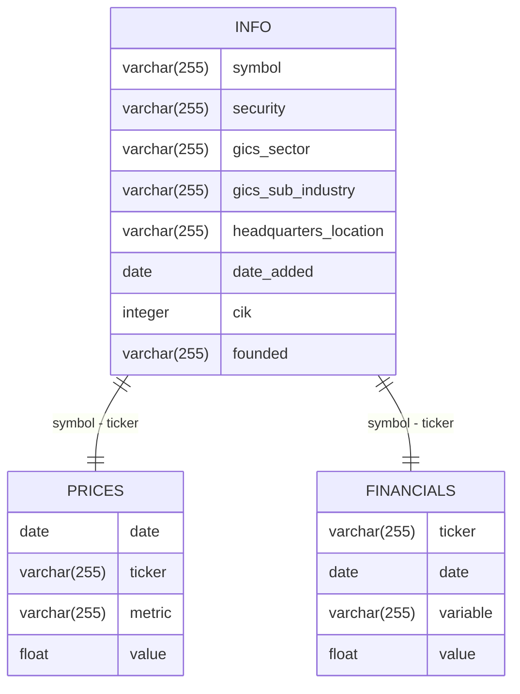

# S&P 500 Data Engineering Project

This project consists of two data pipelines that scrape S&P 500 company information, stock prices, and quarterly financials from Wikipedia and Yahoo Finance. The data is visualized in two dashboards, one created with streamlit and the other with Tableau.

## Project Structure
```
.
├── 01_source_info
│   └── ...
├── 02_source_prices
│   └── ...
├── 03_source_financials
│   └── ...
├── 11_source_info_gdrive
│   └── ...
├── 12_source_prices_gdrive
│   └── ...
├── 13_source_financials_gdrive
│   └── ...
├── README.md
├── create_tables.sql
├── dashboard_streamlit
│   └── ...
├── dashboard_tableau
│   └── ...
├── etl_spx_dashboard.py
├── etl_spx_dashboard_gdrive.py
└── set_env.sh
```

## Apahe Airflow Dags

- The first dag scrapes the data and stores it in a PostgreSQL database.The data in PostgreSQL is used to populate the streamlit dashboard and is found in the `etl_spx_dashboard.py` file. This dag consists of three docker operators:
    - 01_source_info: Scrapes the S&P 500 company information from Wikipedia.
    - 02_source_prices: Scrapes the S&P 500 stock prices from Yahoo Finance.
    - 03_source_financials: Scrapes the S&P 500 quarterly financials from Yahoo Finance.


- The second dag scrapes the data and stores it in Google Sheets. The data in Google Sheets is used to populate the Tableau dashboard and is found in the `etl_spx_dashboard_gdrive.py` file. This dag consists of three docker operators:
    - 11_source_info_gdrive: Scrapes the S&P 500 company information from Wikipedia.
    - 12_source_prices_gdrive: Scrapes the S&P 500 stock prices from Yahoo Finance.
    - 13_source_financials_gdrive: Scrapes the S&P 500 quarterly financials from Yahoo Finance.


## Dashboards

- **Streamlit Dashboard**: Provides a comprehensive view of the SP500 data using PostgreSQL as the data source. The live streamlit dashboard can be accessed at [https://juanberger.com/spx-streamlit](https://juanberger.com/spx-streamlit).


- **Tableau Dashboard**: Visualizes a limited dataset (due to Google Sheets constraints) and is embedded in the project website. The live Tableau dashboard can be accessed at [https://juanberger.com/spx-tableau](https://juanberger.com/spx-tableau).


## PostgreSQL Database Schema

The PostgreSQL database schema includes three primary tables: `info`, `prices`, and `financials`. Clustered indexes and partitioning are used to optimize query performance. 10 years of prices data and the last 4 quarters of financials data are stored in the database.



```sql
-- create schema
CREATE SCHEMA IF NOT EXISTS spx;

-- create table info
CREATE TABLE spx.info
(
  symbol varchar(255),
  security varchar(255),
  gics_sector varchar(255),
  gics_sub_industry varchar(255),
  headquarters_location varchar(255),
  date_added date,
  cik integer,
  founded varchar(255)
);

-- create index for table info
CREATE INDEX IX_info ON spx.info (symbol);

-- create table prices
CREATE TABLE spx.prices 
(
  date date,
  ticker varchar(255),
  metric varchar(255),
  value float
);

-- create index for table prices
CREATE INDEX IX_prices ON spx.prices (ticker, metric, date);

-- create table financials
CREATE TABLE spx.financials 
(
  ticker varchar(255),
  date date,
  variable varchar(255),
  value float
);

-- create index for table financials
CREATE INDEX IX_financials ON spx.financials (ticker, date);
```

## Google Sheets API
Given that Tableau Public does not support direct connections to databases, the Google Sheets API is used to store the data for the Tableau dashboard. The data is stored in three separate sheets: `info`, `prices`, and `financials`. The Google Sheets API is accessed using the `gspread` library in Python. Due to the limitations of Google Sheets, only 365 days of prices data are stored in the Google Sheets.


## Deployment
- The streamlit dashboard is deployed on a self-managed MicroK8s Kubernetes cluster and a second application that embed the Tableau dashboard is also deployed on the same cluster.

Streamlit Dashboard: [https://juanberger.com/spx-streamlit](https://juanberger.com/spx-streamlit)

Tableau Dashboard: [https://juanberger.com/spx-tableau](https://juanberger.com/spx-tableau)
